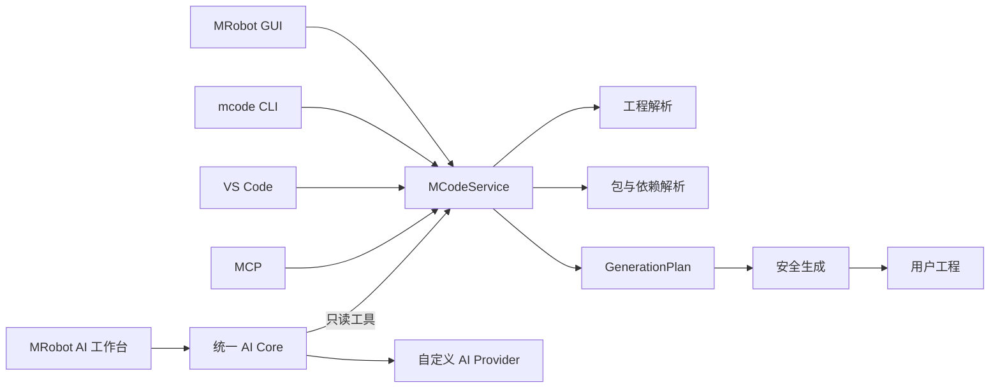

# MRobot

<div align="center">
  

  **面向机器人嵌入式工程的统一代码生成与开发工具**

  STM32CubeMX 优先 · GUI / CLI / VS Code / MCP 共用内核 · 自定义 AI 工作台 · 可独立发布的模块生态

  [](https://github.com/goldenfishs/MRobot/actions/workflows/test.yml)
  [](https://github.com/goldenfishs/MRobot/releases/latest)
  [](LICENSE)
</div>

## MRobot 是什么

MRobot 是机器人嵌入式开发框架、工具和模块生态的总称。本仓库提供桌面 GUI、桌面发布、自动更新和 MCode 集成入口。

[MCode](https://github.com/goldenfishs/MCode) 是无界面的代码生成内核。工程解析、包解析、生成计划、文件写入和校验都由 `MCodeService` 实现；GUI、CLI、VS Code 和 MCP 只是不同前端，不各自维护一套生成规则。

MRobot 当前优先把 STM32CubeMX 路径做稳定、简单和可验证，同时为其他 MCU/SDK 提供统一的平台扩展边界。

## 下载桌面版

从 [最新 Release](https://github.com/goldenfishs/MRobot/releases/latest) 下载与系统匹配的安装包：

| 系统 | 安装包 | 说明 |
|---|---|---|
| macOS Apple Silicon | `MRobot-*-macos-arm64.dmg` | 打开 DMG 后拖入 Applications |
| Windows x64 | `MRobot-*-windows-x64-setup.exe` | 推荐；支持静默自动更新 |
| Windows x64 便携版 | `MRobot-*-windows-x64.zip` | 解压运行；不支持自动覆盖安装 |
| Linux x64 | `MRobot-*-linux-x64.tar.gz` | 解压后运行 `MRobot/MRobot` |

当前 macOS 包使用临时签名，Windows 包尚未配置商业代码签名。若操作系统阻止首次启动，请在确认下载来源后按系统提示手动允许。公开大规模分发前仍需配置 macOS Developer ID、公证和 Windows Authenticode。

## 核心设计



设计原则：

- 所有前端调用同一套核心接口。
- 先生成可检查的 `GenerationPlan`，再写文件。
- 包源码是不可变输入，项目 glue code 与业务入口分离。
- 芯片、板卡、总线能力和设备驱动分层，不为每颗芯片复制整套 BSP。
- 模块可以独立仓库、独立版本和独立发布。
- 不静默覆盖用户修改，不通过删除状态文件绕过冲突。

详细设计见：

- [MCode 架构](docs/architecture/MCODE_ARCHITECTURE.md)
- [包清单规范](docs/architecture/PACKAGE_SPEC.md)
- [AI 工作台架构](docs/architecture/AI_WORKBENCH.md)
- [AI 交接与路线图](AGENTS.md)

## 当前能力

### STM32CubeMX

STM32CubeMX 是当前最完整的平台路径：

- 解析 `.ioc` 中的 MCU、系列、外设、GPIO label 和 FreeRTOS 能力。
- STM32 family 契约覆盖 F1、F4、H7、G4、L4、U5。
- 生成 HAL 句柄绑定，例如 `hspi1`、`huart3`、`hfdcan1`。
- 从真实 `.ioc` 创建 board package。
- 将 UART、SPI、I2C、GPIO、PWM、CAN/FDCAN 等能力映射给上层包。
- 通过 plan、内容哈希、原子写入和 lockfile 保护重复生成。

### 其他平台

| 平台 | 当前状态 |
|---|---|
| STM32CubeMX | 原生 `.ioc` 解析，当前主路径 |
| ESP-IDF | platform pack + `mrobot-project.json` 描述协议 |
| WCH CH32 | platform pack + 通用描述协议 |
| HPM SDK | platform pack + 通用描述协议 |
| TI MSPM0 | platform pack + 通用描述协议 |

非 STM32 平台目前不是完整的原生 SDK 工程解析器。它们共享统一模型和包边界，但仍需要逐个平台补充真实工程解析、编译矩阵和板级验证。

## 五分钟开始使用 MCode

要求 Python 3.10 或更高版本，推荐 Python 3.12。

### 1. 安装

从本仓库安装桌面端和固定版本的 MCode：

```bash
git clone --recurse-submodules https://github.com/goldenfishs/MRobot.git
cd MRobot
python3.12 -m venv .venv
source .venv/bin/activate
python -m pip install --upgrade pip
python -m pip install -e ".[dev]"
```

Windows PowerShell 激活虚拟环境：

```powershell
.venv\Scripts\Activate.ps1
```

只使用代码生成内核时，也可以直接安装 MCode：

```bash
python -m pip install "mrobot-mcode @ git+https://github.com/goldenfishs/MCode.git@v0.4.0"
```

### 2. 检查 CubeMX 工程

将 `/path/to/project` 替换为包含 `.ioc` 的工程目录：

```bash
mcode inspect /path/to/project --json
mcode init /path/to/project
```

### 3. 安装平台和设备包

```bash
mcode package install mrobot.platform.stm32@^0.2.1 --project /path/to/project
mcode package install mrobot.device.bmi088@^0.2.0 --project /path/to/project
```

搜索包：

```bash
mcode package search bmi088
```

### 4. 预览、生成和验证

```bash
mcode plan /path/to/project --json
mcode generate /path/to/project
mcode validate /path/to/project --json
mcode plan /path/to/project --json
```

第一次 `plan` 应只包含预期文件；生成完成后再次 `plan` 不应出现无意义变更。

## 使用桌面 GUI

安装开发依赖后运行：

```bash
python MRobot.py
```

代码生成界面的主路径为：

1. 选择包含 `.ioc` 的 STM32CubeMX 工程。
2. GUI 调用 `MCodeService.inspect()` 解析工程。
3. 选择平台、板卡、BSP、设备、组件、算法、模块或任务包。
4. GUI 写入声明式配置并执行校验。
5. 查看生成计划和冲突信息。
6. 确认后调用同一服务生成文件。

旧的 `app/code_page/` 页面仍用于收集部分选择，但新的解析和生成规则不得写回 GUI 页面或 `app/tools/code_generator.py`。

## 使用 AI 工作台

MRobot 桌面端内置面向机器人嵌入式开发的 AI 工作台。它借鉴了 Claude Desktop/ChatGPT 的工程上下文与工具授权方式，以及 OpenSquilla 的多 Provider、统一会话内核设计，但所有实现均位于 MRobot 自己的 `app/ai/` 核心中。

AI 工作台当前是 **Beta 实验性功能，默认关闭**。关闭时不会创建 AI 页面，主导航和迷你工具箱也不会显示 AI 入口。用户必须在“关于 → 实验性功能”中明确启用后才能使用；该选择会保存在本机，也可随时关闭。

当前支持所有实现 OpenAI-compatible `POST /v1/chat/completions` 的服务，包括：

| Provider | Base URL 示例 | API Key 环境变量 |
|---|---|---|
| OpenAI | `https://api.openai.com/v1` | `OPENAI_API_KEY` |
| DeepSeek | `https://api.deepseek.com` | `DEEPSEEK_API_KEY` |
| 硅基流动 | `https://api.siliconflow.cn/v1` | `SILICONFLOW_API_KEY` |
| 阿里云百炼 | `https://dashscope.aliyuncs.com/compatible-mode/v1` | `DASHSCOPE_API_KEY` |
| OpenRouter | `https://openrouter.ai/api/v1` | `OPENROUTER_API_KEY` |
| Ollama 本地 | `http://127.0.0.1:11434/v1` | 不需要 |
| 自定义服务 | 用户填写的 HTTPS 地址 | 用户填写的变量名 |

使用流程：

1. 在“关于 → 实验性功能”中启用“MRobot AI 工作台（Beta）”。
2. 从主导航或迷你工具箱进入“AI 工作台 Beta”。
3. 点击“添加模型”或“模型设置”，选择预设或填写自定义 Base URL、模型 ID。
4. 在本次运行中输入 API Key，或提前设置对应环境变量。
5. 点击“测试连接”确认地址、权限和模型列表。
6. 可选：选择一个 MRobot/CubeMX 工程，并开启“允许只读工程工具”。
7. 询问 MCU、外设、文件、代码生成计划、冲突或诊断问题。

API Key 不会写入 `profiles.json` 或对话历史。为了跨重启使用，推荐通过系统环境变量或启动脚本注入，不要把密钥放进工程文件。远程自定义接口必须使用 HTTPS；HTTP 只允许 `localhost`、`127.0.0.1` 和 `::1`。

AI 当前可以调用以下只读工具：

- `inspect_project`：读取 MCU、平台、外设、引脚和能力。
- `plan_generation`：预览 MCode 生成计划，不写文件。
- `validate_project`：运行配置与生成冲突诊断。
- `list_project_files`：列出受支持的工程文本文件。
- `read_project_file`：读取工程内单个白名单文本文件，限制为 32 KiB。

工具层会阻止目录穿越、密钥文件、构建目录和工程外文件。AI 不具备 generate、build、flash、debug 或任意命令执行权限；这些写入或硬件动作必须继续由用户在专用界面确认。

本地 Ollama 示例：

```bash
ollama pull qwen3:8b
ollama serve
```

然后在模型设置中选择“Ollama 本地”，把模型 ID 改为 `qwen3:8b`。默认的 `qwen3:0.6b` 只适合连通性测试，不建议用于复杂工程修改建议。

Provider 元数据保存在系统应用数据目录的 `MRobot/ai/profiles.json`，对话保存在 `MRobot/ai/conversations.json`；两者都不保存 API Key。原生 Anthropic Messages、OpenAI Responses、远程/本地 MCP 连接器、图片输入、用量/成本账本和跨设备同步尚未实现。

## 使用零件库

桌面端零件库默认连接 MRobot 的 HTTPS 静态服务：

- 在线目录：`https://download.qutmrobot.cn/parts/v1/catalog.json`
- 文件下载：`https://download.qutmrobot.cn/parts/v1/files/`
- 本地安装目录：系统“文档/MRobot/零件库”

应用只下载约百 KB 的目录文件，选中零件后再按需加载预览，用户点击下载时才获取原始模型。目录会缓存在系统缓存目录，网络暂时不可用时仍可浏览已缓存的条目。

1. 打开主导航中的“零件库”。
2. 等待顶部状态显示“云端已连接”或“离线缓存”。
3. 使用集合、分类、格式和关键词筛选零件。
4. 选择零件后查看格式、大小、云端路径和同目录预览图。
5. 点击“下载此文件”保存到 `文档/MRobot/零件库`，或使用“下载所在目录”把装配体与同目录文件一起保存。

点击“离线资料包”可挂载 ZIP 作为断网后备；若下载目录中存在 `零件库.zip`，云端和缓存均不可用时会自动发现它。大型 ZIP 会被直接索引而不是整包解压，GBK/GB18030 编码的旧中文文件名会自动修复。云端和 ZIP 路径都会拒绝绝对路径及 `..` 目录穿越，下载与导出支持协作式取消。旧的 `http://qutrobot.top:5000` 明文服务和客户端内置密钥不再使用。

## 项目文件

MCode 使用以下项目级文件：

| 文件 | 是否提交版本控制 | 作用 |
|---|---|---|
| `mrobot.yaml` | 是 | 平台、包、bindings 和 actions 的声明式配置 |
| `mrobot.lock` | 是 | 固定平台输入、精确包版本和内容哈希 |
| `.mrobot/generated-state.json` | 通常是 | 记录生成文件所有权和上次生成哈希 |
| `.ioc` | 是 | STM32CubeMX 硬件配置来源 |

`mrobot.yaml` 中的 build、flash、debug 和 clean action 使用 argv 数组。MCode 直接启动命令，不通过 shell 拼接参数。

```bash
mcode run build --project /path/to/project
mcode run flash --project /path/to/project
mcode run debug --project /path/to/project
mcode run clean --project /path/to/project
```

这些动作只是安全调度项目提供的工具命令，不代表仓库已经替用户安装工具链、选择探针或完成真机验证。

## 安全生成和用户代码保护

MCode 将输出区分为两类：

- `generated`：由生成器拥有。再次生成前比较内容哈希；发现用户修改时报告冲突并拒绝覆盖。
- `scaffold`：只创建一次，之后完全归用户所有。

写入过程使用临时文件和原子替换。包和输入版本写入 `mrobot.lock`，保证团队成员能够复现相同计划。

迁移旧工程时可以显式使用：

```bash
mcode generate /path/to/project --adopt
```

`--adopt` 只接管包含可识别 `USER ... BEGIN/END` 区域的旧文件并保留区域内容。没有 USER 标记的已有文件仍然是冲突，不会被隐式覆盖。

## 包生态

官方索引位于 [mrobot-registry](https://github.com/goldenfishs/mrobot-registry)。包使用 `mrobot-package.yaml` 描述，支持 SemVer、递归依赖、`requires`/`provides` 能力和项目级缓存。

支持的包类型：

- `platform`：SDK/平台适配。
- `board`：MCU、晶振、引脚和板载设备信息。
- `bsp`：GPIO、UART、SPI、CAN 等硬件能力封装。
- `device`：传感器、执行器和通信设备驱动。
- `component`：通用组件与基础算法。
- `algorithm`：可独立组合的算法实现。
- `module`：云台、底盘、发射等功能模块。
- `task`：任务入口和调度模板。

常用包命令：

```bash
mcode package search <keyword>
mcode package install <package>@<constraint> --project <project>
mcode package remove <package> --project <project>
mcode package validate /path/to/package
mcode package create mrobot.component.example --type component
mcode package board board.ioc mrobot.board.my-board
```

新模块应优先创建独立仓库和清单，不再继续扩充本仓库中的旧 `assets/User_code` 目录。

## 统一接口与前端

### Python

```python
from mcode import MCodeService

service = MCodeService()
model = service.inspect("/path/to/project")
plan = service.plan("/path/to/project")
```

### CLI

`mcode --json` 为脚本和插件提供稳定机器可读输出。CLI 不重新实现业务规则。

### MCP

安装 MCode 后启动 stdio MCP 服务：

```bash
mcode-mcp
```

MCP 提供工程检查、计划、生成、验证和包搜索等能力。涉及文件生成时仍应遵循“inspect → plan → 用户确认 → generate → validate”的顺序。

### VS Code

[mcode-vscode](https://github.com/goldenfishs/mcode-vscode) 是薄前端，提供 inspect、plan、generate、validate、build、flash 和 debug 命令。

## 桌面自动更新

桌面 GUI 和 `mrobot-update` CLI 共用 `app/update_service.py`：

```bash
mrobot-update --json check
mrobot-update --json download
mrobot-update --json install --desktop-path /path/to/MRobot.app
```

更新链路：

1. 优先读取 `https://updates.qutmrobot.cn/stable/update.json`。
2. 主清单不可用时读取 GitHub Release 的 `update.json`。
3. 只有两个清单都不可用时才访问兼容旧版本的 GitHub API。
4. 从 `https://download.qutmrobot.cn` 下载版本化安装包。
5. 根据清单内嵌 SHA-256 校验完整文件；不发布独立 `.sha256` 文件。
6. 校验通过后才准备平台对应的安装流程。

Windows 自动安装只选择 Inno Setup `*-setup.exe`。macOS 和 Linux 使用独立安装助手，在当前进程退出后替换程序；失败时保留或恢复旧程序。源码运行模式不会覆盖源码本身。

## 仓库结构

```text
MRobot/
├── app/                       # 桌面 GUI 和统一更新服务
│   ├── ai/                    # Provider、会话、只读工具和 AI agent loop
│   └── part_library/          # ZIP 索引、中文编码修复和安全按需导出
├── mcode/                     # 固定版本的 MCode Git 子模块
├── assets/                    # GUI 资源与待迁移旧资源
├── docs/architecture/         # 架构和包规范
├── deploy/                    # 更新服务器 Caddy 配置
├── tests/                     # 集成、架构、发布与更新测试
├── tools/                     # 构建、清单和迁移工具
├── MRobot.py                  # 桌面入口
├── MRobot.spec                # PyInstaller 配置
└── AGENTS.md                  # 完整 AI 交接说明和路线图
```

相关仓库：

| 仓库 | 职责 |
|---|---|
| [MCode](https://github.com/goldenfishs/MCode) | 无界面核心、CLI、schema、MCP |
| [mrobot-registry](https://github.com/goldenfishs/mrobot-registry) | 官方包索引 |
| [mcode-vscode](https://github.com/goldenfishs/mcode-vscode) | VS Code 前端 |
| [mcode-skill](https://github.com/goldenfishs/mcode-skill) | AI 安全操作工作流 |
| [mrobot-platform-stm32](https://github.com/goldenfishs/mrobot-platform-stm32) | STM32 平台适配 |

## 本地开发与测试

初始化子模块并安装依赖：

```bash
git submodule update --init --recursive
python3.12 -m venv .venv
source .venv/bin/activate
python -m pip install --upgrade pip
python -m pip install -e "./mcode[dev]"
python -m pip install -e ".[dev]"
```

运行 MRobot 测试：

```bash
python -m pytest -q
python -m compileall -q app tools MRobot.py
```

运行 MCode 测试：

```bash
(cd mcode && python -m pytest -q)
```

测试通过只能证明自动化范围内的行为，不等同于所有 MCU、编译器、探针和真实板卡均已验证。

## 构建和发布桌面包

在目标系统原生构建：

```bash
python tools/build_desktop.py
```

输出位于 `release-dist/`。发布流水线在以下原生 runner 上并行构建：

- macOS 15 / arm64
- Windows 2025 / x64
- Ubuntu 24.04 / x64

推送符合 `v*` 的 tag 后，GitHub Actions 会：

1. 在三个平台运行测试并构建原生包。
2. 生成内嵌安装包 SHA-256 的 `update.json`。
3. 创建 GitHub Release。
4. 上传安装包和 `update.json`。
5. 将安装包同步到 `download.qutmrobot.cn`。
6. 原子更新 `updates.qutmrobot.cn/stable/update.json`。

## 当前边界

- STM32CubeMX 之外的平台尚未达到同等原生解析深度。
- 尚未保证自动修改所有 CubeIDE `.cproject`、Keil、CMake 和 Makefile 工程元数据。
- GUI 包管理仍在从旧选择页面迁移到完整 registry 浏览、依赖树和冲突界面。
- MCP 尚未覆盖 CLI/Service 的所有包管理和迁移参数。
- AI 工作台当前只实现 OpenAI-compatible Chat Completions；尚无原生 Anthropic/Responses adapter 和外部 MCP 连接器。
- AI 工具刻意保持只读，不能自动生成、构建、烧录或执行任意系统命令。
- 真机 build/flash/debug 需要明确的板卡、工具链、探针和 action 配置。
- macOS、Windows 正式代码签名仍待配置。

## 路线图

近期优先级：

1. 补充真实 F4/H7/G4/L4/U5 CubeMX 工程和交叉编译矩阵。
2. 完成 CubeIDE、CMake、Makefile 的生成文件接入。
3. 在 GUI 中提供 plan、diff、冲突和 adopt 决策界面。
4. 完整接入 registry 搜索、版本选择、依赖树和能力提供者。
5. 验证 STM32CubeProgrammer、OpenOCD、J-Link、ST-Link action profile。
6. 使用真实板卡完成构建、烧录、复位和串口 smoke test。
7. STM32 主路径稳定后，再逐个平台实现原生 SDK importer。
8. 为 AI 工作台增加原生 Responses/Anthropic adapter、MCP 连接器和逐工具授权界面，再评估受确认保护的写操作。

更完整的完成情况与后续任务见 [AGENTS.md](AGENTS.md)。

## 贡献

欢迎提交 Issue 和 Pull Request。修改生成规则时请同时提供：

- 可检查的 plan 行为。
- 成功、重复执行、错误和冲突测试。
- 不丢失用户代码的证据。
- 对应文档、schema 或迁移说明。

模块、设备和算法贡献优先采用独立包仓库，而不是直接复制到桌面仓库。

## License

[MIT](LICENSE)
