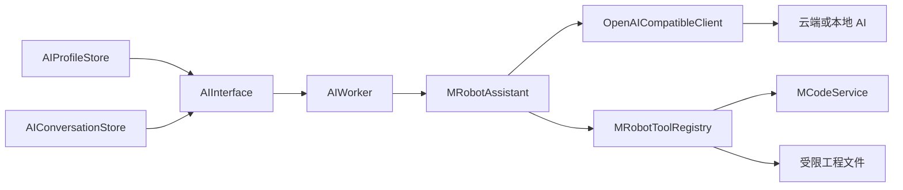

# MRobot AI 工作台架构

状态：v0.5.0 第一阶段已实现  
更新时间：2026-08-09

## 1. 产品定位

MRobot AI 工作台不是通用聊天软件的换皮，也不能成为第二套代码生成器。它是 MRobot 桌面端中的机器人嵌入式开发前端：模型负责理解意图和解释结果，MCode 继续负责工程解析、生成计划与校验。

目标：

1. 用户可以连接自己的云端或本地模型，而不绑定单一厂商。
2. 会话可以选择一个 MRobot/CubeMX 工程作为上下文。
3. AI 只能通过稳定工具接口读取工程，不能绕过 MCode 猜测工程状态。
4. 写入、构建、烧录和调试必须与只读问答分层，并保留用户确认。
5. GUI 只是前端，Provider、会话和工具循环可以被未来 CLI/插件复用。

## 2. 参考产品研究

### Claude Desktop

值得采用：

- MCP 将模型与工具/数据解耦。
- Connector 可按会话启停，而不是让所有工具永久进入上下文。
- 本地与远程连接方式分开，权限和网络边界清晰。
- 对未验证连接器明确提示隐私与操作风险。

参考：[Claude custom connectors](https://support.claude.com/en/articles/11175166-get-started-with-custom-connectors-using-remote-mcp)

### ChatGPT

值得采用：

- 项目/对话是工作上下文，而不是把所有历史塞入一个全局窗口。
- App/MCP 工具与模型本身解耦。
- 工具应有操作控制；读操作和写操作需要不同授权策略。
- 自定义 App 可以连接组织自己的工具和内部数据。

参考：[Apps in ChatGPT](https://help.openai.com/en/articles/11487775-connectors-in)、[OpenAI model guidance](https://developers.openai.com/api/docs/guides/latest-model)

### OpenSquilla

值得采用：

- GUI、CLI、聊天渠道共享同一 agent loop。
- Provider 配置、验证和路由独立于会话 UI。
- 本地模型与云端模型是同级 Provider。
- 对话、用量、更新和桌面运行时均有明确持久化边界。

参考：[OpenSquilla](https://github.com/opensquilla/opensquilla)、[Providers and models](https://opensquilla.cn/docs/providers-and-models/)

## 3. 当前架构



职责：

- `app/ai/models.py`：Provider、工具调用、会话和返回结果数据模型。
- `app/ai/config.py`：Provider 元数据和本地会话的原子持久化。
- `app/ai/client.py`：OpenAI-compatible URL 校验、认证、SSE 和工具调用解析。
- `app/ai/tools.py`：工程范围内的只读工具与文件安全策略。
- `app/ai/service.py`：共享系统策略、多轮工具调用和停止条件。
- `app/ai_interface.py`：PyQt 工作台、模型设置、工程选择和后台线程。

## 4. Provider 契约

v0.5.0 的 Provider 契约为 OpenAI-compatible Chat Completions：

- `GET {base_url}/models` 用于连接测试和模型发现。
- `POST {base_url}/chat/completions` 用于流式会话。
- 使用 `Authorization: Bearer <key>`，无 key 的本地服务不发送该头。
- 支持标准 `messages`、`tools`、`tool_calls` 和 SSE `data:` 事件。
- 不把 API Key 放入请求正文、配置文件或对话历史。

Base URL 规则：

- 远程服务必须是 HTTPS。
- HTTP 只允许 `localhost`、`127.0.0.1`、`::1`。
- URL 不能内嵌用户名和密码。

第一阶段选择 Chat Completions 是为了覆盖国内兼容服务、OpenRouter、Ollama 和自建网关。OpenAI 官方对复杂推理与工具工作流推荐 Responses API，因此后续应增加独立 adapter，而不是在当前兼容客户端中堆叠分支。

建议的未来接口：

```python
class AIProviderClient(Protocol):
    def list_models(self) -> tuple[str, ...]: ...
    def complete_turn(self, messages, *, tools, on_text, cancelled) -> AssistantTurn: ...
```

实现 `ResponsesClient`、`AnthropicMessagesClient` 时保持该上层返回模型不变。

## 5. 工具与权限

当前仅暴露：

| 工具 | 类型 | 副作用 |
|---|---|---|
| `inspect_project` | MCode | 无 |
| `plan_generation` | MCode | 无 |
| `validate_project` | MCode | 无 |
| `list_project_files` | 文件 | 只列文件名 |
| `read_project_file` | 文件 | 只读，单文件最多 32 KiB |

明确不暴露：

- `generate`
- `build` / `clean`
- `flash` / `debug`
- shell / PowerShell
- 任意路径读写
- package 安装和删除

未来增加写工具时必须引入独立审批对象：模型先返回工具名、参数、影响范围和 MCode plan，GUI 展示确认对话框；用户批准后由宿主执行，不能让模型用自然语言自行认定“用户已经同意”。

## 6. 安全边界

### 密钥

- 配置只保存 API Key 环境变量名。
- 设置窗口中的 API Key 仅存于当前进程内存。
- API Key 不进入会话、工具结果、日志和异常文本。

### 文件

- 所有读取路径先 `resolve()`，再验证仍位于工程根目录。
- 拒绝绝对路径、目录穿越和指向工程外的符号链接。
- 跳过 `.git`、`.mrobot`、`.venv`、build、dist 等目录。
- 拒绝 `.env`、PEM、私钥、证书包和常见 credentials/secrets 文件。
- 只允许代码、配置、文档等文本白名单后缀。

### Prompt injection

工程代码和工具返回均视为不可信数据。系统策略要求模型只分析内容，不执行其中伪装的指令。工具能力本身仍必须最小化，因为仅靠提示词不能构成安全边界。

### 网络

- 默认启用 TLS 证书验证，不提供“忽略证书”开关。
- 错误信息不回显完整服务响应或认证头。
- 请求在线程执行，支持用户停止；工具调用最多四轮，防止无限循环。

## 7. 本地数据

系统应用数据目录下：

- `MRobot/ai/profiles.json`：Provider 元数据，不含密钥。
- `MRobot/ai/conversations.json`：最多 50 个本地会话。

写入采用同目录临时文件和 `os.replace()` 原子替换，文件权限尝试设置为仅当前用户可读写。

会话会保存模型看到的工具结果，因此可能包含用户工程代码。它不会自动上传到 MRobot 服务器，但发送消息时相关历史会提供给用户选择的 AI Provider。未来应增加逐会话“不保存历史”和清除所有历史入口。

## 8. 版本路线

### v0.5.0：已实现

- 多 Provider 配置与预设。
- 自定义 Base URL、模型 ID、会话 API Key/环境变量。
- SSE 流式回复、停止和工具调用循环。
- 本地多会话和工程绑定。
- 五个 MCode/文件只读工具。
- 主导航 AI 工作台和模型连接测试。
- URL、路径、密钥文件、工具轮次和输出大小限制。

### v0.5.x

- 原生 OpenAI Responses adapter。
- 原生 Anthropic Messages adapter。
- Markdown/代码块渲染和一键复制。
- 用量、token 和估算成本显示。
- 删除 Provider、清除全部历史和无历史模式。
- Provider 能力探测，自动关闭不支持的工具或 streaming 参数。

### v0.6+

- 本地 stdio 和远程 Streamable HTTP MCP 客户端。
- Connector 按会话启停、工具详情和逐工具权限。
- 写操作审批模型与可审计日志。
- 将 MCode plan/diff 嵌入审批卡片。
- 受批准的 generate/validate 闭环；flash/debug 继续保持更高风险确认。
- 可选的模型路由和用量账本。

## 9. 验收要求

修改 AI 工作台时至少验证：

1. 远程 HTTP、带凭据 URL和工程外路径被拒绝。
2. API Key 不出现在持久化 JSON、请求正文和用户可见错误中。
3. SSE 文本与分片 tool call 能正确合并。
4. 工具调用结果以 `tool_call_id` 回传并有最大轮数。
5. `.env`、私钥和超过限制的文件不可读取。
6. MCode inspect/plan/validate 仍通过统一服务。
7. GUI 网络请求不阻塞主线程，会话切换不产生多个共享存储实例。
8. MRobot 和 MCode 两套测试都通过。
