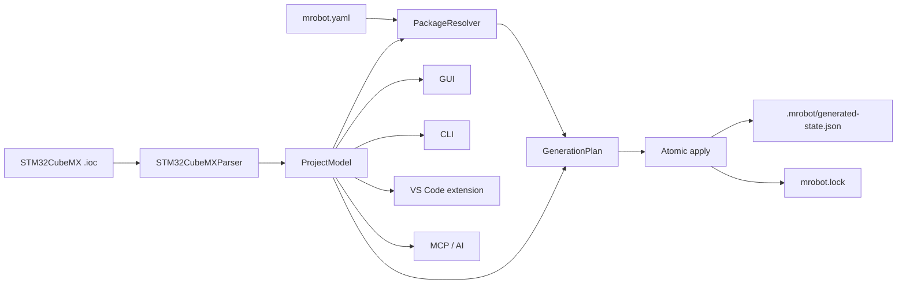

# MRobot / MCode 可持续架构

## 命名与职责

- **MRobot**：组织名、嵌入式框架名和整个生态的品牌。
- **MCode**：无界面的工程分析、包解析、代码生成和验证引擎。
- **mrobot-mcode**：Python 发布包名；导入名和命令统一为 `mcode`。
- GUI、CLI、VS Code 插件和 MCP/AI 工具都是前端，不拥有业务规则。

STM32CubeMX 是完整原生路径。其他 MCU 平台通过 platform pack 和统一项目描述协议接入，不在 UI 中增加条件分支。

## 单一生成流水线

所有前端调用 `MCodeService.inspect/configure/plan/generate/validate`。CLI 的 `--json` 是跨进程稳定协议；`mcode-mcp` 和 VS Code 插件均为该接口的薄包装。

## BSP 分层

1. CubeMX/HAL：供应商生成层，由 CubeMX 管理。
2. `platform-stm32`：STM32 通用适配、家族差异和 CubeMX 能力映射。
3. `board-*`：板卡引脚、时钟、供电和板载器件定义。
4. `bsp-*`：CAN/UART/SPI/GPIO/PWM 等稳定抽象。
5. device/component/algorithm/module/task：只依赖能力或其他包，不依赖 GUI 目录。

芯片型号不对应一份复制的 BSP。芯片家族差异属于 platform pack，板卡差异属于 board pack，具体外设实例由 `.ioc` 和项目配置绑定。

## 文件所有权

| 策略 | 行为 | 适用内容 |
|---|---|---|
| `generated` | MCode 可重复生成；哈希不匹配则报冲突 | glue、注册表、CMake 清单、模型快照 |
| `scaffold` | 仅首次创建，之后完全归用户 | 业务任务、用户回调、应用入口 |
| CubeMX user sections | 仅作为旧工程兼容机制 | CubeMX 自有文件中的极少量接入代码 |

包源码视为不可变输入。实例配置和 glue 输出到 `User/MRobot/generated`，业务代码不再混入生成模板。生成先计划、后原子写入；失败回滚，绝不静默覆盖用户修改。

`mrobot.lock` 固定 MCU、`.ioc` 内容哈希以及包版本/内容哈希，适合进入版本控制；`.mrobot/generated-state.json` 只记录文件所有权和上次生成哈希，可按团队策略忽略。

## 仓库边界与命名

- `goldenfishs/MRobot`：桌面 GUI 与生态入口，逐步变薄。
- `goldenfishs/MCode`：独立的核心、CLI、schema 和前端协议。
- `goldenfishs/mrobot-platform-stm32`：STM32CubeMX 平台包。
- `goldenfishs/mrobot-board-<board>`：板卡包。
- `goldenfishs/mrobot-device-<name>`、`mrobot-component-<name>`、`mrobot-algorithm-<name>`、`mrobot-module-<name>`、`mrobot-task-<name>`：可独立发布的功能包。

## 已完成的迁移基线

1. MCode 已独立发布，MRobot 通过固定版本子模块和 Python 依赖消费它。
2. GUI 生成按钮、CLI、VS Code 和 MCP 均调用统一服务。
3. STM32CubeMX、F1/F4/H7/G4/L4/U5 家族契约及板级包生成已落地。
4. 旧 assets 已批量迁移为独立包仓库，MCode 在计划阶段完成兼容模板渲染。
5. 官方 registry 提供 SemVer、递归依赖、能力提供者和 lockfile。
6. ESP-IDF、WCH CH32、HPM SDK 和 TI MSPM0 使用统一项目描述协议与独立 platform pack。
